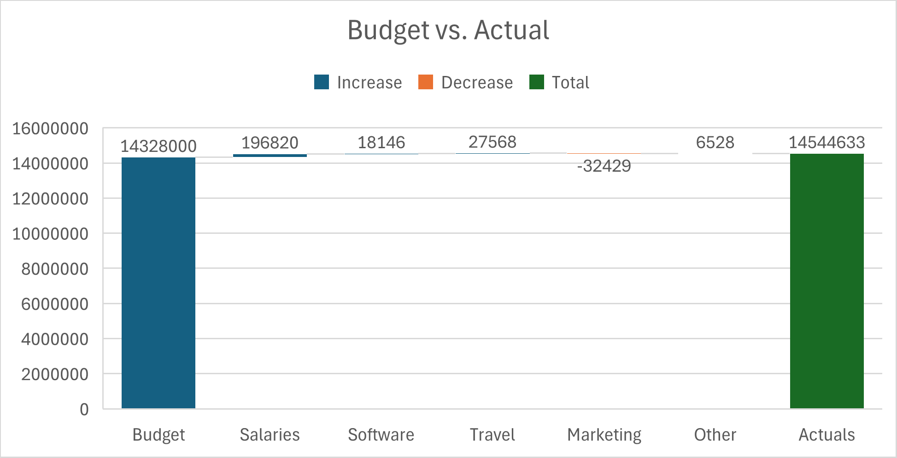
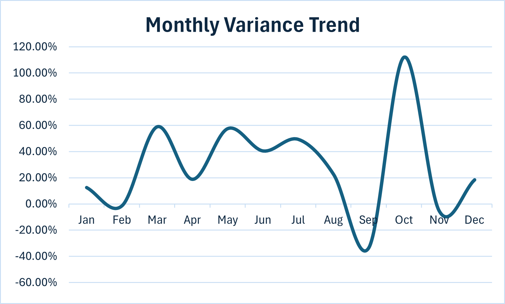
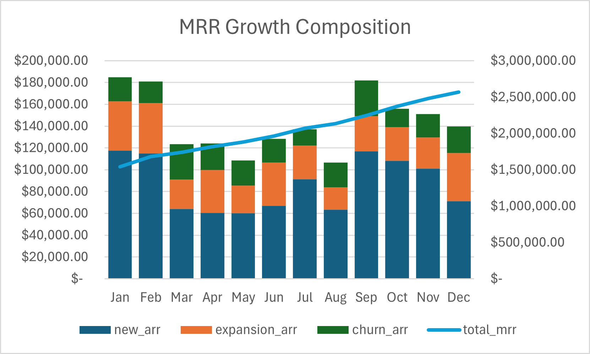

# FPA - Portfolio

# 📊 CloudMetrics FP&A Portfolio Project

> **Role Target:** Financial Analyst / FP&A Analyst
> **Industry Focus:** SaaS / B2B Tech
> **Tools:** Excel (Advanced) · Power BI · Python · SQL

---

## 🧭 Project Overview

This project simulates the core FP&A workflow at a fictional Series B SaaS company — **CloudMetrics Inc.** ($18M ARR, 120 employees) — covering two deliverables that mirror real day-one analyst work:

1. **Budget vs. Actuals Variance Dashboard** — tracks OPEX across 4 departments and 60 line items with automated RAG commentary
2. **13-Week Rolling Cash Flow Forecast** — models weekly cash position with Bear / Base / Bull scenario toggle

Built end-to-end: data generation → Excel modeling → Power BI dashboard → Python automation.

---

## 🔑 Key Findings

| Insight | Detail |
|---|---|
| 📈 ARR Growth | +22% YTD vs. 18% budget — driven by expansion revenue outperforming plan |
| 🔴 Material Variance | Sales & Marketing ran **14% over budget** in Q3 due to accelerated campaign spend |
| 🟢 Offset | R&D came in **8% under budget** — partially absorbed the S&M overspend |
| 💵 Base Case Cash | 13-week ending balance of **$2.3M** — above $500K minimum buffer throughout |
| ⚠️ Bear Case Alert | Cash breaches minimum buffer by **Week 10** — hiring pause needed by Week 7 |
| 📉 Net Churn Rate | Held below 2.1% monthly — within healthy SaaS benchmark range |

## 📊 Dashboard Charts

### Chart 1 — Budget Vs. Actual


### Chart 2 — Monthly Variance Trend


### Chart 3 — MRR Growth Composition



---

## 📁 Repository Structure

```
cloudmetrics-fpa/
├── raw_data/
│   ├── budget_2024.csv          # Monthly budget by dept & category
│   ├── actuals_2024.csv         # Monthly actuals with realistic variance
│   ├── mrr_data.csv             # MRR, new ARR, expansion, churn
│   └── headcount_roster.csv     # 120-employee roster with salary data
│
├── excel_models/
│   ├── BudgetVsActuals_Model.xlsx   # Core variance model (7 tabs)
│   └── CashFlow_13Week.xlsx         # 13-week forecast with scenario toggle
│
├── python_scripts/
│   ├── generate_data.py         # Generates all CSV datasets
│   └── variance_report.py       # Auto-generates RAG variance commentary to Excel
│
├── notebooks/
│   └── variance_analysis.ipynb  # Jupyter walkthrough of variance analysis
│
├── screenshots/
│   ├── dashboard_executive.png  # Power BI executive summary page
│   ├── dashboard_variance.png   # Variance deep dive page
│   └── dashboard_saas.png       # SaaS revenue analytics page
│
└── README.md
```

---

## 🛠 Tools & Skills Demonstrated

| Tool | How It's Used |
|---|---|
| **Excel (Advanced)** | 3-statement OPEX model, SUMIFS, IFERROR, CHOOSE() scenario toggle, conditional formatting, waterfall charts |
| **Power BI** | Data model with relationships, DAX measures (YTD, DIVIDE, LASTDATE), drill-through, KPI cards |
| **Python (Pandas)** | Dataset generation, variance calculation, automated commentary, Excel output with openpyxl |
| **DAX** | YTD Actuals, ARR Run Rate, Net Churn Rate, Variance %, MRR Latest |

---

## ⚡ Quickstart

### 1. Clone the repo
```bash
git clone https://github.com/Lohithredy19/cloudmetrics-fpa.git
cd cloudmetrics-fpa
```

### 2. Install Python dependencies
```bash
pip install pandas openpyxl numpy
```

### 3. Generate the dataset
```bash
python python_scripts/generate_data.py
```
This creates all 4 CSV files in `raw_data/`.

### 4. Run the variance report
```bash
python python_scripts/variance_report.py
```
Outputs `Variance_Report_Auto.xlsx` with RAG color coding and auto-commentary.

### 5. Open the Excel models
Open `excel_models/BudgetVsActuals_Model.xlsx` — data is pre-linked to the CSVs. Refresh with `Data > Refresh All`.

---

## 📊 Dashboard Preview

### Executive Summary


### Variance Deep Dive


### SaaS Revenue Analytics


---

## 🏢 Company Profile — CloudMetrics Inc.

| Parameter | Value |
|---|---|
| Business Model | B2B SaaS — project management software |
| Stage | Series B |
| ARR | ~$18M |
| Employees | 120 FTEs |
| Fiscal Year | Calendar year (Jan–Dec) |
| Cost Centers | R&D, Sales & Marketing, G&A, COGS |
| Key Metrics | MRR, ARR, Gross Churn, NRR, CAC Payback |

---

## 📐 Model Assumptions

All assumptions are editable in the `Assumptions` tab of each Excel model. Key defaults:

**Budget vs. Actuals**
- Budget based on Series B SaaS benchmarks (R&D ~45% of OPEX, S&M ~30%)
- Actuals generated with ±10–25% realistic noise per line item
- RAG thresholds: Green < 7% | Amber 7–15% | Red > 15%

**13-Week Cash Flow**
- Opening cash: $2,500,000
- Collection lag: 30 days (Base) | 45 days (Bear) | 21 days (Bull)
- Payroll: bi-weekly, $940K/month (Base)
- Minimum cash buffer: $500,000

---

## 💡 Why This Project

FP&A roles in SaaS companies require analysts to own the budget process, explain variances to business partners, and forecast cash with enough precision to support hiring and investment decisions.

This project demonstrates:
- **Business judgment** — not just calculating variances, but knowing which ones matter and why
- **Technical range** — Excel for modeling, Power BI for storytelling, Python for automation
- **SaaS fluency** — ARR, churn, expansion revenue, and runway are the language of tech finance
- **Efficiency mindset** — automating month-end commentary is the kind of thinking CFOs reward

---

## 📬 Contact

**Lohith Annapuredy**
Financial Analyst | FP&A | SaaS & Tech
LinkedIn URL · Email · Requires H1B Transfer/Sponsorship

---

*Built as a portfolio project to demonstrate FP&A technical skills. All data is fictional and generated for modeling purposes.*
